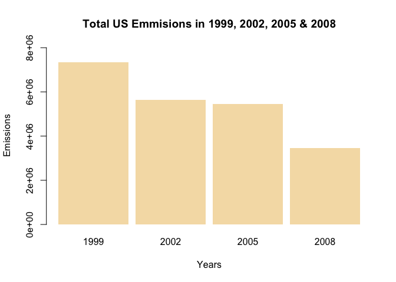
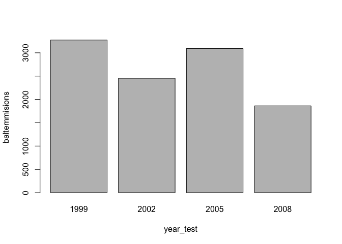

Project 2
================
Nicholas Philo
27/07/2020

## Downloading the data

``` r
library(tidyr)
```

``` r
dta_url <- "https://d396qusza40orc.cloudfront.net/exdata%2Fdata%2FNEI_data.zip"
download.file(dta_url , destfile = "unzipme.zip", method = "curl")
unzip("unzipme.zip")
```

## Reading in the data

``` r
NEI <- readRDS("summarySCC_PM25.rds")
SCC <- readRDS("Source_Classification_Code.rds")
```

now investigating the data:

``` r
str(NEI)
```

    ## 'data.frame':    6497651 obs. of  6 variables:
    ##  $ fips     : chr  "09001" "09001" "09001" "09001" ...
    ##  $ SCC      : chr  "10100401" "10100404" "10100501" "10200401" ...
    ##  $ Pollutant: chr  "PM25-PRI" "PM25-PRI" "PM25-PRI" "PM25-PRI" ...
    ##  $ Emissions: num  15.714 234.178 0.128 2.036 0.388 ...
    ##  $ type     : chr  "POINT" "POINT" "POINT" "POINT" ...
    ##  $ year     : int  1999 1999 1999 1999 1999 1999 1999 1999 1999 1999 ...

``` r
str(SCC)
```

    ## 'data.frame':    11717 obs. of  15 variables:
    ##  $ SCC                : Factor w/ 11717 levels "10100101","10100102",..: 1 2 3 4 5 6 7 8 9 10 ...
    ##  $ Data.Category      : Factor w/ 6 levels "Biogenic","Event",..: 6 6 6 6 6 6 6 6 6 6 ...
    ##  $ Short.Name         : Factor w/ 11238 levels "","2,4-D Salts and Esters Prod /Process Vents, 2,4-D Recovery: Filtration",..: 3283 3284 3293 3291 3290 3294 3295 3296 3292 3289 ...
    ##  $ EI.Sector          : Factor w/ 59 levels "Agriculture - Crops & Livestock Dust",..: 18 18 18 18 18 18 18 18 18 18 ...
    ##  $ Option.Group       : Factor w/ 25 levels "","C/I Kerosene",..: 1 1 1 1 1 1 1 1 1 1 ...
    ##  $ Option.Set         : Factor w/ 18 levels "","A","B","B1A",..: 1 1 1 1 1 1 1 1 1 1 ...
    ##  $ SCC.Level.One      : Factor w/ 17 levels "Brick Kilns",..: 3 3 3 3 3 3 3 3 3 3 ...
    ##  $ SCC.Level.Two      : Factor w/ 146 levels "","Agricultural Chemicals Production",..: 32 32 32 32 32 32 32 32 32 32 ...
    ##  $ SCC.Level.Three    : Factor w/ 1061 levels "","100% Biosolids (e.g., sewage sludge, manure, mixtures of these matls)",..: 88 88 156 156 156 156 156 156 156 156 ...
    ##  $ SCC.Level.Four     : Factor w/ 6084 levels "","(NH4)2 SO4 Acid Bath System and Evaporator",..: 4455 5583 4466 4458 1341 5246 5584 5983 4461 776 ...
    ##  $ Map.To             : num  NA NA NA NA NA NA NA NA NA NA ...
    ##  $ Last.Inventory.Year: int  NA NA NA NA NA NA NA NA NA NA ...
    ##  $ Created_Date       : Factor w/ 57 levels "","1/27/2000 0:00:00",..: 1 1 1 1 1 1 1 1 1 1 ...
    ##  $ Revised_Date       : Factor w/ 44 levels "","1/27/2000 0:00:00",..: 1 1 1 1 1 1 1 1 1 1 ...
    ##  $ Usage.Notes        : Factor w/ 21 levels ""," ","includes bleaching towers, washer hoods, filtrate tanks, vacuum pump exhausts",..: 1 1 1 1 1 1 1 1 1 1 ...

``` r
NEI$fips <- as.factor(NEI$fips)
NEI$Pollutant <- as.factor(NEI$Pollutant)
NEI$type <- as.factor(NEI$type)

length(levels(NEI$fips))
```

    ## [1] 3263

``` r
year_test <- levels(as.factor(NEI$year))
year_test
```

    ## [1] "1999" "2002" "2005" "2008"

``` r
head(NEI)
```

    ##     fips      SCC Pollutant Emissions  type year
    ## 4  09001 10100401  PM25-PRI    15.714 POINT 1999
    ## 8  09001 10100404  PM25-PRI   234.178 POINT 1999
    ## 12 09001 10100501  PM25-PRI     0.128 POINT 1999
    ## 16 09001 10200401  PM25-PRI     2.036 POINT 1999
    ## 20 09001 10200504  PM25-PRI     0.388 POINT 1999
    ## 24 09001 10200602  PM25-PRI     1.490 POINT 1999

``` r
f1 <- function(yr){
    subset(NEI, year == yr)
}


YEARS <- lapply(year_test,f1)


f2 <- function(dta_list){
    sum(dta_list$Emissions)
}

tot_em <- sapply(YEARS,f2)

barplot(tot_em ~ year_test, xlab = "Years",ylab = "Emissions" ,main = "Total US Emmisions in 1999, 2002, 2005 & 2008", col = "wheat", space = 0.1, border = NA, axes = TRUE, ylim = c(  0,max(tot_em)*1.1  )  )
```

<!-- -->

``` r
cond_baltimore <- which(as.character(NEI$fips) == "24510")
balt <- NEI[cond_baltimore,]

fa <- function(yr){
    subset(balt, year == yr)
}

baltyr <- lapply(year_test,fa)

fb <- function(dta_list){
    sum(dta_list$Emissions)
}

baltemmisions <- sapply(baltyr,fb)

barplot(baltemmisions~year_test)
```

<!-- -->
